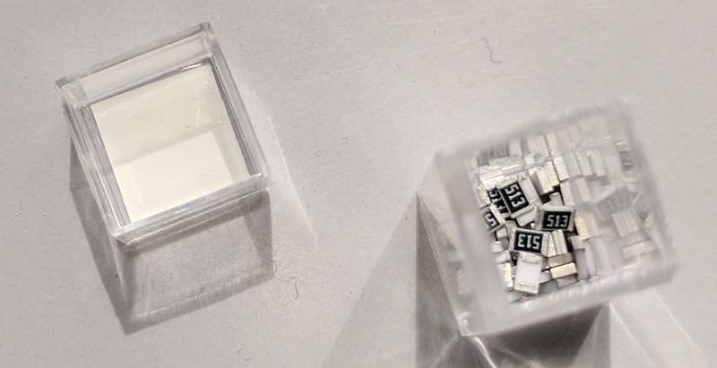

# Iterative Trimmer

Online Calculator: [petermaerki.github.io/iterativetrimmer](https://petermaerki.github.io/iterativetrimmer)

Repository: [github.com/petermaerki/iterativetrimmer](https://github.com/petermaerki/iterativetrimmer)

**An alternative approach to adjust something very accurate in electronic circuits by assembling fix value resistors instead of using trimmers or potentiometers.**

A resistor can be precisely tuned by placing additional resistors in parallel. We present a technique using 4
parallel resistors, of which two are in series (A and B in schematic below). We use a potentiometer parallel to
the existing resistor to get the target resistance, which will be placed next. We use this python script to
successively determine the resistors A and B, then C, and later D. Depending on the initial error of resistor E,
we reduce the error by two to three orders of magnitude by placing the resistors A and B, and one to two orders
of magnitude each for C and D.

## Rationale

Trimmers and Potentiometers are bulky, expensive and have a limited resolution. In addition cermet trimmers show a lot of flicker noise. If you need something really stable, this approach could be something for you.

## How is it done?

The resistance is adjusted in mutliple iterations by measuring and assembling of fix value resistors.

- Needed: Resistor set, thinfilm, E24, values from 10 Ohm to 1 Mohm.
- The target value should be between 50 Ohm and 1 Mohm.

### Example

Resistor E is assembled (optional). Offset has
to be adjusted by reducing the total resistance. The resistor is a part of a circuit where the optimal
point can be measured. Let's assume it is an offset of an amplifier.

Trimmer P is connected temporary and adjusted until offset is zero. Trimmer is removed and resistance P is measured.

Target resistance: 11203

Result
- A: 11000
- B: 220
- C: 12000
- D: 11000

Assembling of resistors
- A: 11000
- B: 220

Trimmer P is adjusted until offset is zero.

Trimmer is removed and resistance P is measured.

Target resistance: 5700
Result
- A: 5600
- B: 110
- C: 6200
- D: 5600

            
Assembling of resistor

C: 6200

Trimmer P is adjusted until offset is zero.

Trimmer is removed and resistance P is measured.

Target resistance: 830000
Result
- A: 820000
- B: 11000
- C: 910000
- D: 820000

        

Assembling of resistor

D: 820000

Example: set of fix value resistors.

A device to speed up the trimming process. Switch to Rx, test-pins pressed on the circuit board, adjusting a trimmer. The range can be selected. Switch to Multimeter. Reading the resistance of the trimmer from the multimeter.

#### An example of a circuit board.

R11 and R111 are assembled initialy to make the circuit working.

According to the initial offset the left side R11 or the right side R111 has to be reduced.

The yellow letters show an adjustment of the left side.
A good trimmer would need more space on the pcb.

## Some background information

### First step: two resistors A and B

This step is important and difficult. The reason to use a script.

- By taking two resistors in serie, it is possible to make a very fine adjustment with C.
- B has to be as small as possible to adjust very sensitive with C and D.
- B hast to be big enough to be able to adjust the rest with C and D.
- A and B have to be near the target value.
- A and B have to be a bit biger than the target value.

### Next step: C

- C hast to be a bit biger than the target.

### Next step: D

- D is picked to be as near to the target as possible.

## Why not simple put resistors in parallel?
If you do this you end up at very high resistance values. Thinfilm resistors ar avaiable only up to 1 MOhm.

By assembling two in the first step, you get a more accurate first step and less sensibility in the
following steps.

## How accurate is the adjustment?

In the simulation you can see the relative error to the ramdomly choosen target value. (Target value for A and B)

- Target values below 10 Ohm: not possible because we do not have that low fixed resistors.
- Target values above 2 MOhm: not possible because we do not have that high fixed resistors.
- Target values between 20 Ohm and 100 kOhm work quite well.
- Sometimes the iteration get stuck, when the needed resistance value is to high. (red point on green point for example). This happens above an initial target value of 10 kOhm.

If you start with an initial resistor E and you can assemble resistors A, B, C and D you get the additional resistance to E about 1E-5 accurate. The value of E, A, B, C and D will be even more accurate, 1E-6 for example.

It is important to have good thinfilm resistors. I measured the typical error of 55 piece 10k resistors
(ERA6A) and got a maximum error of 0.015% from 10kOhm. This tolerance is used in the python script.

### Why iterative and not in one step?

Consider the tolerance of the multimeter used to measure the trimmer P and the limited accuracy of the fix
value resistors and the possible change of the resistance value due to soldering. By doing it iterative,
errors in the former steps will be corrected in the following steps.

### Is there a better concept for iterative trimming than the shown here?

I developed this as i needed a solution. It fulfilled my requirement perfectly. It is possible
there is an more efficient way to do it. Suggestions are welcome!

Please feel free to optimize for your needs. Feedback is welcome!

Peter Maerki, Zelglistrasse 49, 8634 Hombrechtikon, Switzerland.
https://www.positron.ch/iterativetrimmer https://petermaerki.github.io/iterativetrimmer

